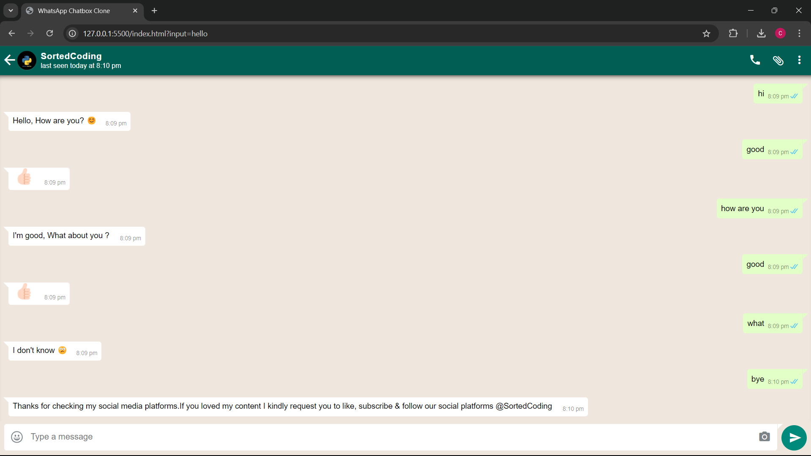

# Whatsappp chatbox clone

A video player built with React and TypeScript that features Picture-in-Picture (PIP) mode with custom media controls. This project leverages media-chrome to handle player interactions and transitions between inline and floating video modes, making it user-friendly and interactive.

## 🛠️ Technologies

- **HTML**
- **CSS**
- **JavaScript**

## 🎥 Video

